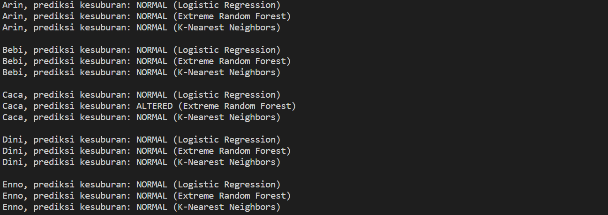

# Machine Learning Exam

#

### **Soal 1 - Diagnosis Kesuburan**

Disediakan __1 buah dataset__ (*fertility.csv*) yang menunjukkan kondisi fisik, kebiasaan & rutinitas sehari-hari beberapa pasien wanita, berkaitan dengan tingkat kesuburannya. Unduh dataset dari repo ini: [klik sini](./fertility.csv) atau langsung dari sumbernya: [klik sini](https://www.kaggle.com/gabbygab/fertility-data-set).

Dari dataset tersebut dibuat sebuah __file python__ yang mengandung __3 buah algoritma model machine learning__  untuk memprediksi diagnosis kesuburan terhadap profil wanita berikut:

- 👩‍🔧 __Arin (*Montir, 29 th*)__
    
    Sejak kecil terkenal sehat & lincah, tak pernah mengalami penyakit serius. Usai menjadi Sarjana Teknik, Arin meneruskan usaha bengkel ayahnya. Setiap hari menghabiskan 5 jam untuk duduk, sembari merokok & mengkonsumsi alkohol.

- 👩‍🍳 __Bebi (*Chef, 31 th*)__

    Memutuskan fokus menggeluti bidang kuliner setelah 10 tahun yang lalu kakinya terpaksa diamputasi lantaran kecelakaan lalu lintas. Tidak merokok namun dalam seminggu beberapa kali mengkonsumsi alkohol.

- 👩‍🌾 __Caca (*Gardener, 25 th*)__

    Pecinta lingkungan yang terobsesi dengan gaya hidup sehat. Sayangnya daya tahan tubuhnya lemah. Sedari kecil hingga kini, Caca kerap kali terjangkit penyakit, terutama batuk, pilek & demam. Dalam sehari, 7 jam ia habiskan untuk duduk.

- 👩‍🎓 __Dini (*Dosen, 28 th*)__

    Dosen muda ini 2 bulan lalu baru saja menjalani operasi patah tulang rusuk, akibat cedera saat berolahraga. Kini ia terpaksa duduk di kursi roda, selama masih dalam masa penyembuhan hingga 1 bulan ke depan. Setiap hari Dini merokok, namun sangat anti pada alkohol.

- 👩‍⚕ __Enno (*Dokter, 42 th*)__

    Semasa kecil, Enno kerap kali terjangkit asma akut. Bahkan pernah menjalani perawatan intensif akibat _bronkitis_. Kini sebagai dokter umum, ia senantiasa menjaga kebersihan & kesehatan. Dalam sehari, 8 jam ia habiskan untuk melayani konsultasi pasien di poli umum.

Output yang dihasilkan adalah prediksi kesuburan untuk kelima wanita di atas, menggunakan metode machine learning: _Logistic Regression_, _Extreme Random Forest_, dan _K-Nearest Neighbors_.
1. Jalankan file _**utama.py**_. (_Perhatikan bahwa file **model.py** hanya untuk membuat model ML!_)
2. Screenshot hasil prediksi pada terminal:
    

*__to be improved:__ Perhatikan bahwa hasil prediksi untuk kelima pasien di atas kebanyakan masih memberikan nilai NORMAL saja. Hal ini dikarenakan data set yang dimiliki masih terlalu __bias__, dimana kebanyakan hasil diagnosisnya masih memberikan hasil yang NORMAL (88 NORMAL : 12 ALTERED)*

### **_Enjoy!_**

#

#### Albertus Rianto Wibisono ✉ _albertusrian95@gmail.com_

[Instagram](https://www.instagram.com/rian__wibisono) | 
[LinkedIn](https://www.linkedin.com/in/albertusrian95/) |
[GitHub](https://www.github.com/RiantoWibisono)